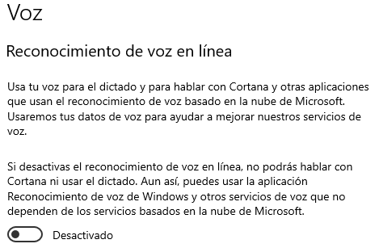

# Evaluation of Web Speech API for Text-to-Speech:

## Software Used

If you haven't configured [Windows Voice Recognition](https://support.microsoft.com/en-us/windows/use-voice-typing-to-talk-instead-of-type-on-your-pc-fec94565-c4bd-329d-e59a-af033fa5689f) yet, you'll need to complete the following steps:

Press Win + H, and you will receive a prompt if you need to grant permissions:

You can grant permissions here:

Next, you'll need to select the spoken language you intend to use:

If you don't see your desired language, you can install it adding a preffered language or from the Windows Store:

Please check the options for installation:

Afterward, you'll be prompted to relog. Be cautious when doing this, as the keyboard language may differ, and you may need to change it to input your credentials.

## Methodology

Press Win + H, select the location where you want to input your text, and click on the microphone to start.
Press stop when you're ready to finish.

## Initial Results

- **Conversion Speed**: Fast
- **Cost**: Free
- **Local Computer Usage Without Sending Information**: It does send information to Microsoft.
- **Limitations**: Only tested for short sentences and the results weren't bad. It didn't seem to include punctuation marks unless you use voice commands to insert them.
- **Compatibility**: Windows 10, 11
